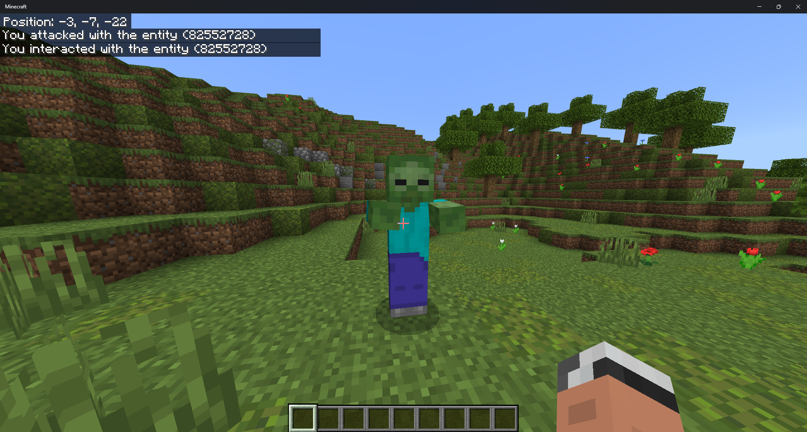
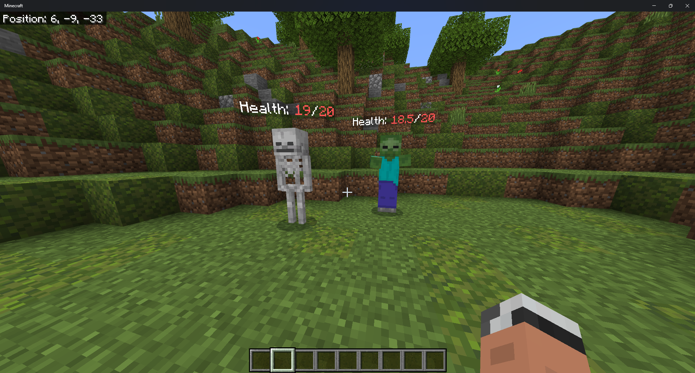
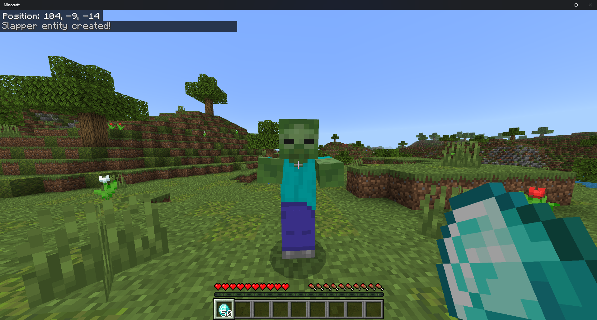

## Creating Custom Components

Custom components allow developers to create custom functionality for a specific Entity, Block, or Item type. From here on out, we will refer to Entities, Blocks, and Items as Nodes. Custom components can also be bound to pre-existing Nodes during runtime. Custom components also allow the data stored in the component to be read/written to the World LevelDB instance. A good example would be creating an economy plugin, in which a custom component is bound to every player that contains their balance.

### Getting Started

Creating custom components is world-specific, which means the plugin must register the custom component to the palette at the initialization of the world. This also means worlds can have different custom component palettes.

#### Entity Components

Sample usage for creating a simple component. This creates a simple text output interaction for when a player interacts/attacks with the entity.  
**[Explore Code](./entity.ts)**  

  

Healthbar component, this creates a healthbar that will visualize the entity's current health.  
**[Explore Code](./entity-healthbar.ts)**  

  

Slapper component, this creates a custom component that allows executes commands at the player when interacted. This component will also read/write the component data to the LevelDB for storage!
**[Explore Code](./entity-slapper.ts)**  

  

